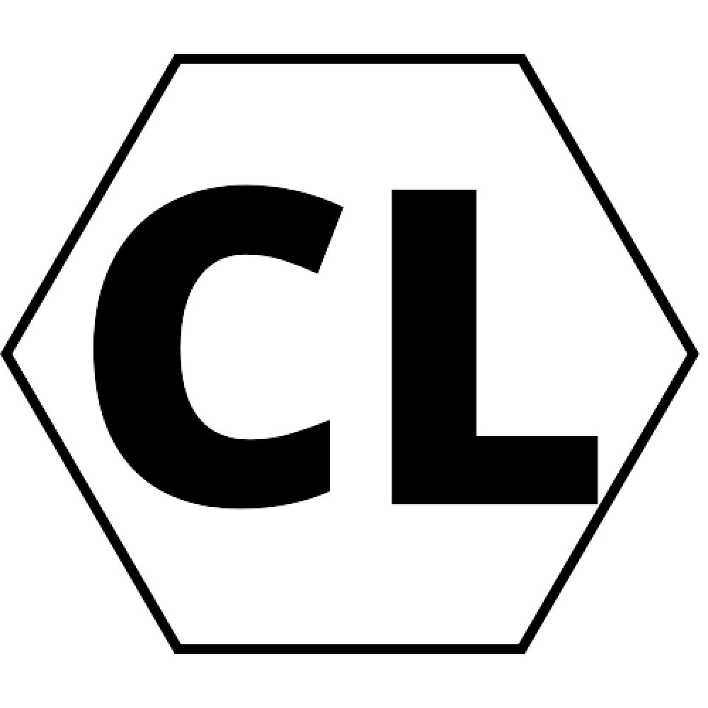
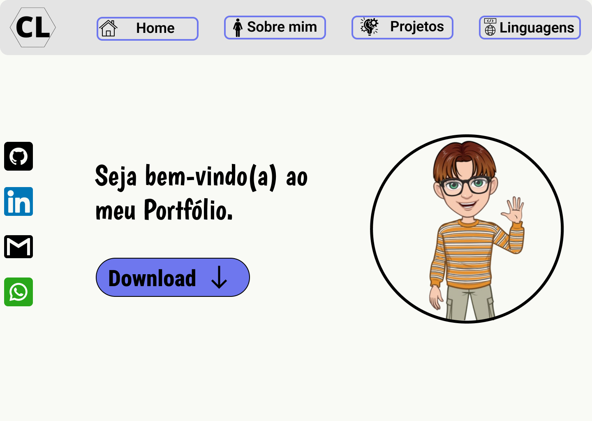

<h1 align="center"> Portfólio </h1>

Este é o meu Portfólio

  

  <a href="#-tecnologias">Tecnologias</a>&nbsp;&nbsp;&nbsp;|&nbsp;&nbsp;&nbsp;
  <a href="#-projeto">Projeto</a>&nbsp;&nbsp;&nbsp;|&nbsp;&nbsp;&nbsp;
  <a href="#-layout">Layout</a>&nbsp;&nbsp;&nbsp;|&nbsp;&nbsp;&nbsp;

 

## 🚀 Tecnologias  

Este projeto foi desenvolvido com as seguintes tecnologias:

- HTML e CSS
- JavaScript
- Git e Github
- Figma

## 💻 Projeto

Se você está curioso, você pode conhece-lo clicando [aqui](https://cleoleal.github.io/Portfolio/index.html).

## 🔖 Layout

  

Você pode visualizar o layout do projeto através [desse link](https://www.figma.com/file/H4OtNsHWj6pVe3naVMuFFi/Portfolio---Cleo-Leal?type=design&node-id=0%3A1&mode=design&t=EBjeYObWcdFWAEbe-1). Necessita de uma conta no [Figma](https://figma.com) para acessa-lo.
